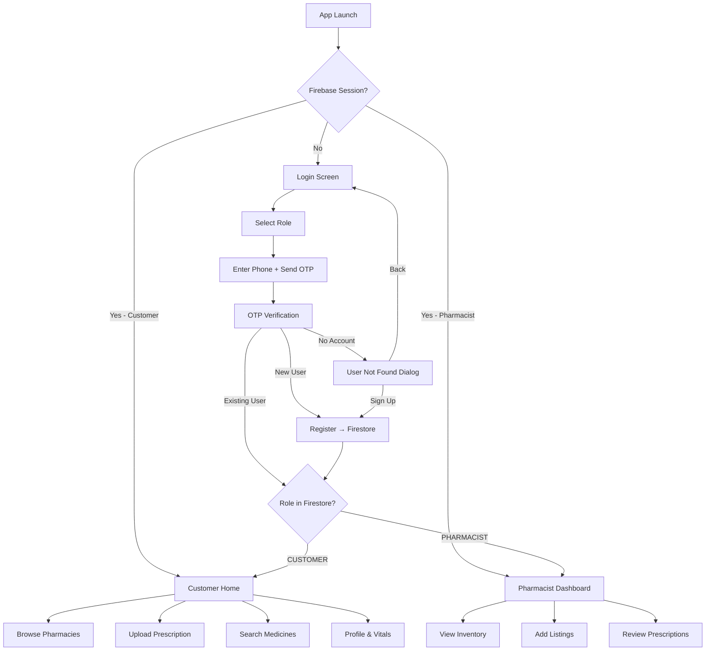

<p align="center">
  
</p>

<h1 align="center">GramaSanjeevini</h1>

<p align="center">
  <em>Your Village Pharmacy Network</em>
</p>

<p align="center">
  
  
  
  
  
  
</p>

---

## 📖 About

**GramaSanjeevini** (Grama Sanjeevini - "Village Life-Giver") is a mobile-first pharmacy locator and prescription management app designed for rural India. It connects villagers with their nearest pharmacies, enables digital prescription uploads, and gives pharmacists a real-time dashboard to manage inventory and review incoming prescriptions.

---

## ✨ Features

### 🧑‍💻 For Customers
- **GPS-Powered Pharmacy Discovery** — Finds nearby pharmacies sorted by real-time distance.
- **Category-Based Medicine Search** — Browse by category (Pills, Bandages, Vitamins, Allergy, Digestive, Hydration).
- **Prescription Upload** — Photograph a handwritten prescription and send it directly to the nearest pharmacy via Firebase Storage.
- **Health Profile** — Store personal vitals (age, gender, blood type) securely in Firestore.
- **Dark / Light Mode** — User-controlled theme toggle, with system default as fallback.

### 💊 For Pharmacists
- **Dedicated Dashboard** — View store metrics (total inventory, pending prescriptions) in real-time.
- **Inventory Management** — Add, list, and manage medicine stock tied to a verified Firestore store.
- **Prescription Viewer** — See incoming patient prescriptions with full-screen image preview, user details, and a one-tap "Mark Reviewed" action.
- **Live Badge Notifications** — Bottom navigation badge shows the count of pending prescriptions.

### 🔐 Authentication & Security
- **Phone + OTP Login** — Firebase Phone Authentication with auto-verification support.
- **Role-Based Routing** — Customers and pharmacists have completely separate navigation stacks and dashboards.
- **Persistent Sessions** — App remembers login state; re-opens directly to the correct home screen (Customer or Pharmacist).
- **User Not Found Dialog** — Graceful handling when an unregistered number attempts to log in, with options to sign up or go back.
- **Centralized Error Strings** — All user-facing messages come from `AppStrings.kt`; no raw exception text is ever shown.

---

## 🏗️ Architecture

The app follows a clean **MVVM** (Model–View–ViewModel) architecture built with Jetpack Compose.

```
app/src/main/java/com/example/grama_sanjeevini/
│
├── 📄 MainActivity.kt                  # Entry point, theme setup
│
├── 📁 constants/
│   ├── AppStrings.kt                    # Centralized user-facing messages
│   └── theme/
│       ├── Color.kt                     # Color palette (light & dark)
│       ├── Font.kt                      # Poppins font family
│       ├── Theme.kt                     # Material3 theme configuration
│       └── Type.kt                      # Typography scale
│
├── 📁 data/
│   ├── model/
│   │   ├── Medicine.kt                  # Medicine data class
│   │   ├── Pharmacy.kt                  # Pharmacy / store data class
│   │   ├── Prescription.kt              # Prescription data class
│   │   └── User.kt                      # User profile data class
│   └── repository/
│       ├── AuthRepository.kt            # Firebase Auth abstraction
│       ├── LocationRepository.kt        # GPS location + geocoding
│       ├── PharmacyRepository.kt        # Firestore pharmacy queries
│       └── PrescriptionRepository.kt    # Prescription CRUD + Storage
│
├── 📁 navigation/
│   ├── BottomNavBar.kt                  # Customer bottom navigation
│   └── NavGraph.kt                      # Root navigation + nested graphs
│
├── 📁 ui/
│   ├── auth/
│   │   ├── LoginScreen.kt              # Phone login with role selector
│   │   ├── OtpScreen.kt                # OTP verification
│   │   └── RegisterScreen.kt           # New user registration
│   ├── home/
│   │   └── HomeScreen.kt               # Customer home (pharmacies, categories, upload)
│   ├── pharmacist/
│   │   ├── AddListingScreen.kt          # Add medicine to inventory
│   │   ├── DashboardScreen.kt           # Pharmacist store overview
│   │   └── PrescriptionsScreen.kt       # Incoming prescription viewer
│   ├── profile/
│   │   └── ProfileScreen.kt            # User profile + health vitals
│   ├── search/
│   │   └── SearchScreen.kt             # Medicine search
│   ├── shop/
│   │   └── ShopDetailScreen.kt         # Individual pharmacy detail page
│   └── splash/
│       └── SplashScreen.kt             # Animated splash with auth check
│
└── 📁 viewmodel/
    ├── AuthViewModel.kt                 # Login/register state machine
    ├── HomeViewModel.kt                 # Customer home logic + uploads
    └── PharmacistViewModel.kt           # Dashboard + inventory + Rx
```

---

## 🛠️ Tech Stack

| Layer | Technology |
|---|---|
| **Language** | Kotlin 2.0 |
| **UI Framework** | Jetpack Compose + Material3 |
| **Navigation** | Navigation Compose 2.8 (nested graphs) |
| **Authentication** | Firebase Phone Auth (OTP) |
| **Database** | Cloud Firestore |
| **File Storage** | Firebase Cloud Storage |
| **Location** | Google Play Services Location 21.3 |
| **Image Loading** | Coil 2.7 |
| **Async** | Kotlin Coroutines + Flow |
| **Architecture** | MVVM (ViewModel + Compose State) |
| **Min SDK** | 26 (Android 8.0 Oreo) |
| **Target SDK** | 35 (Android 15) |

---

## 🚀 Getting Started

### Prerequisites

- **Android Studio** Ladybug (2024.2.1) or newer
- **JDK 17**
- A **Firebase project** with Phone Authentication, Firestore, and Cloud Storage enabled

### Setup

1. **Clone the repository**
   ```bash
   git clone https://github.com/Dhakshil/GramaSanjeevini.git
   cd GramaSanjeevini
   ```

2. **Firebase configuration**
   - Go to [Firebase Console](https://console.firebase.google.com/)
   - Create a project (or use an existing one)
   - Add an Android app with package name `com.example.grama_sanjeevini`
   - Download `google-services.json` and place it in `app/`
   - Enable **Phone Authentication** under Authentication → Sign-in method
   - Create a **Firestore Database** in production or test mode
   - Enable **Cloud Storage** under Storage → Get started

3. **Build and Run**
   ```bash
   ./gradlew assembleDebug
   ```
   Or open the project in Android Studio and press ▶️ Run.

---

## 🔥 Firebase Structure

### Firestore Collections

```
users/
  └── {uid}/
        ├── name: String
        ├── phone: String
        ├── role: "CUSTOMER" | "PHARMACIST"
        ├── gender: String (optional)
        ├── age: String (optional)
        ├── bloodType: String (optional)
        └── createdAt: Long

pharmacies/
  └── {pharmacyId}/
        ├── name: String
        ├── address: String
        ├── phone: String
        ├── latitude: Double
        ├── longitude: Double
        ├── openTime: String
        ├── closeTime: String
        ├── ownerId: String (linked to user uid)
        └── inventory/
              └── {itemId}/
                    ├── name: String
                    ├── category: String
                    ├── price: Double
                    ├── stock: Int
                    └── description: String

prescriptions/
  └── {prescriptionId}/
        ├── userId: String
        ├── userName: String
        ├── userPhone: String
        ├── pharmacyId: String
        ├── receiptUrl: String (Firebase Storage URL)
        ├── status: "pending" | "reviewed"
        └── timestamp: Long
```

### Cloud Storage

```
receipts/
  └── {uid}/
        └── {timestamp}.jpg
```

---

## 📱 App Flow



---

## 🎨 Design System

- **Typography**: [Poppins](https://fonts.google.com/specimen/Poppins) — clean, modern, highly legible
- **Color Palette**: Custom Material3 scheme with dynamic light/dark variants
- **Icons**: 20+ custom vector drawables (no emoji in any UI surface)
- **Components**: Glassmorphic cards, gradient headers, animated transitions, pulsing loaders
- **Principles**: Mobile-first, touch-friendly (48dp min targets), accessible contrast ratios

---

## 📸 Screenshots


<!-- Uncomment and update paths after adding screenshots:
| Customer Home | Pharmacist Dashboard | Prescription Upload |
|:---:|:---:|:---:|
|  |  |  |

| Login | OTP Verification | Profile |
|:---:|:---:|:---:|
|  |  |  |
-->

---


<!-- ## 🔒 Recommended Firebase Security Rules

### Firestore
```javascript
rules_version = '2';
service cloud.firestore {
  match /databases/{database}/documents {

    // Users can read/write their own document
    match /users/{userId} {
      allow read, write: if request.auth != null && request.auth.uid == userId;
    }

    // Pharmacies are readable by all authenticated users
    // Writable only by the owner pharmacist
    match /pharmacies/{pharmacyId} {
      allow read: if request.auth != null;
      allow write: if request.auth != null
        && resource.data.ownerId == request.auth.uid;

      match /inventory/{itemId} {
        allow read: if request.auth != null;
        allow write: if request.auth != null;
      }
    }

    // Prescriptions: readable by the patient or the pharmacist
    match /prescriptions/{rxId} {
      allow read: if request.auth != null
        && (resource.data.userId == request.auth.uid
            || resource.data.pharmacyId in getPharmacyIds(request.auth.uid));
      allow create: if request.auth != null;
      allow update: if request.auth != null;
    }
  }
}
```

### Cloud Storage
```javascript
rules_version = '2';
service firebase.storage {
  match /b/{bucket}/o {
    match /receipts/{userId}/{fileName} {
      allow read: if request.auth != null;
      allow write: if request.auth != null
        && request.auth.uid == userId
        && request.resource.size < 10 * 1024 * 1024;
    }
  }
}
``` -->

---

## 🤝 Contributing

1. Fork the repository
2. Create your feature branch (`git checkout -b feature/amazing-feature`)
3. Commit your changes (`git commit -m 'Add amazing feature'`)
4. Push to the branch (`git push origin feature/amazing-feature`)
5. Open a Pull Request

---

## 📄 License

This project is licensed under the **MIT License** — see the [LICENSE](LICENSE) file for details.

---

<p align="center">
  Built with ❤️ for rural India
  <br/>
  <strong>GramaSanjeevini</strong> — Bridging the gap between villages and healthcare
</p>
